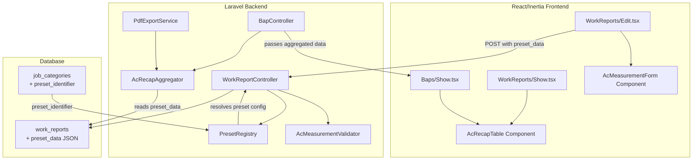

# Design Document: AC Work Report Preset

## Overview

This feature introduces a preset/template system for work reports tied to job categories. The initial implementation targets the AC (Air Conditioning) maintenance category, enabling technicians to capture structured technical measurements (suhu R/S/T, ampere R/S/T, tekanan freon) alongside unit identification data (tipe, merek, kapasitas). The AC measurement data is stored as a JSON column on the `work_reports` table and rendered in both web views and PDF BAP output as a "REKAP DATA PEKERJAAN MAINTENANCE AC" table.

The design follows a **registry pattern** where a `preset_identifier` on `JobCategory` maps to a known preset configuration. This keeps the system extensible for future category-specific presets without requiring schema changes.

### Key Design Decisions

1. **Registry-based preset resolution** over database-stored field definitions: Preset configurations are defined in code (a PHP registry class) rather than stored in a separate database table. This is simpler to implement, version-controlled, and sufficient given the current need for a single AC preset with a fixed field structure.

2. **JSON column (`preset_data`) on `work_reports`** over a separate normalized table: The AC measurement data structure is specific to this preset and accessed as a whole unit. JSON storage avoids complex joins and allows the schema to evolve per-preset without migrations.

3. **Single aggregation service** for both web and PDF rendering: The logic for filtering AC work reports and aggregating their entries into a consolidated table is shared between the Blade PDF template and the React frontend, ensuring consistency.

## Architecture



## Components and Interfaces

### 1. PresetRegistry (Backend Service)

Resolves a preset identifier string to its configuration. Acts as the single source of truth for available presets.

```php
interface PresetRegistryInterface
{
    /**
     * Check if a preset identifier exists.
     */
    public function has(string $identifier): bool;

    /**
     * Get the preset configuration for a given identifier.
     * Returns null if not found.
     */
    public function get(string $identifier): ?array;

    /**
     * Get all registered preset identifiers.
     */
    public function all(): array;
}
```

The AC preset configuration returned by `get('ac_maintenance')`:

```php
[
    'identifier' => 'ac_maintenance',
    'label' => 'AC Maintenance',
    'fields' => [
        'lokasi' => ['type' => 'text', 'max' => 255, 'required' => true],
        'tipe_ac' => ['type' => 'select', 'options' => ['Splitduct', 'Cassette', 'Splitwall'], 'required' => true],
        'merek' => ['type' => 'text_or_select', 'options' => ['Panasonic', 'Gree', 'Daikin'], 'max' => 100, 'required' => true],
        'kapasitas' => ['type' => 'numeric', 'min' => 0.5, 'max' => 30, 'unit' => 'PK', 'required' => true],
        'suhu_before_r' => ['type' => 'numeric', 'min' => -10, 'max' => 100, 'unit' => '°C', 'required' => true],
        'suhu_before_s' => ['type' => 'numeric', 'min' => -10, 'max' => 100, 'unit' => '°C', 'required' => true],
        'suhu_before_t' => ['type' => 'numeric', 'min' => -10, 'max' => 100, 'unit' => '°C', 'required' => true],
        'suhu_after_r' => ['type' => 'numeric', 'min' => -10, 'max' => 100, 'unit' => '°C', 'required' => true],
        'suhu_after_s' => ['type' => 'numeric', 'min' => -10, 'max' => 100, 'unit' => '°C', 'required' => true],
        'suhu_after_t' => ['type' => 'numeric', 'min' => -10, 'max' => 100, 'unit' => '°C', 'required' => true],
        'ampere_before_r' => ['type' => 'numeric', 'min' => 0, 'max' => 200, 'unit' => 'A', 'required' => true],
        'ampere_before_s' => ['type' => 'numeric', 'min' => 0, 'max' => 200, 'unit' => 'A', 'required' => true],
        'ampere_before_t' => ['type' => 'numeric', 'min' => 0, 'max' => 200, 'unit' => 'A', 'required' => true],
        'ampere_after_r' => ['type' => 'numeric', 'min' => 0, 'max' => 200, 'unit' => 'A', 'required' => true],
        'ampere_after_s' => ['type' => 'numeric', 'min' => 0, 'max' => 200, 'unit' => 'A', 'required' => true],
        'ampere_after_t' => ['type' => 'numeric', 'min' => 0, 'max' => 200, 'unit' => 'A', 'required' => true],
        'freon_before' => ['type' => 'numeric', 'min' => 0, 'max' => 800, 'unit' => 'PSI', 'required' => true],
        'freon_after' => ['type' => 'numeric', 'min' => 0, 'max' => 800, 'unit' => 'PSI', 'required' => true],
        'keterangan' => ['type' => 'text', 'max' => 1000, 'required' => false],
    ],
    'min_entries' => 1,
    'max_entries' => 50,
]
```

### 2. AcMeasurementValidator (Backend Service)

Validates AC measurement data before persistence.

```php
interface AcMeasurementValidatorInterface
{
    /**
     * Validate an array of AC measurement entries.
     * Returns validated data on success, throws ValidationException on failure.
     *
     * @param array $entries Array of AC measurement entry arrays
     * @return array Validated and sanitized entries
     * @throws \Illuminate\Validation\ValidationException
     */
    public function validate(array $entries): array;
}
```

### 3. AcRecapAggregator (Backend Service)

Aggregates AC measurement data across multiple work reports for display in recap tables.

```php
interface AcRecapAggregatorInterface
{
    /**
     * Aggregate AC measurement entries from a collection of work reports.
     * Filters to only AC-category reports with valid preset_data.
     * Orders by work report date ascending, then entry order.
     * Returns a flat array of rows with sequential numbering.
     *
     * @param \Illuminate\Support\Collection $workReports Collection of WorkReport models (with category loaded)
     * @return array Array of aggregated row data with keys: no, tanggal, lokasi, tipe_ac, merek, kapasitas, suhu_before_r/s/t, suhu_after_r/s/t, ampere_before_r/s/t, ampere_after_r/s/t, freon_before, freon_after, keterangan
     */
    public function aggregate(\Illuminate\Support\Collection $workReports): array;
}
```

### 4. AcMeasurementForm (React Component)

A reusable React component rendering the AC measurement form fields. Handles adding/removing entries, field validation feedback, and data binding.

```typescript
interface AcMeasurementEntry {
    lokasi: string;
    tipe_ac: 'Splitduct' | 'Cassette' | 'Splitwall' | '';
    merek: string;
    kapasitas: number | '';
    suhu_before_r: number | '';
    suhu_before_s: number | '';
    suhu_before_t: number | '';
    suhu_after_r: number | '';
    suhu_after_s: number | '';
    suhu_after_t: number | '';
    ampere_before_r: number | '';
    ampere_before_s: number | '';
    ampere_before_t: number | '';
    ampere_after_r: number | '';
    ampere_after_s: number | '';
    ampere_after_t: number | '';
    freon_before: number | '';
    freon_after: number | '';
    keterangan: string;
}

interface AcMeasurementFormProps {
    entries: AcMeasurementEntry[];
    onChange: (entries: AcMeasurementEntry[]) => void;
    errors?: Record<string, string>;
    disabled?: boolean;
}
```

### 5. AcRecapTable (React Component)

A reusable React component rendering the AC recap table used in both Work Report detail and BAP detail pages.

```typescript
interface AcRecapRow {
    no: number;
    tanggal: string;
    lokasi: string;
    tipe_ac: string;
    merek: string;
    kapasitas: number;
    suhu_before_r: number;
    suhu_before_s: number;
    suhu_before_t: number;
    suhu_after_r: number;
    suhu_after_s: number;
    suhu_after_t: number;
    ampere_before_r: number;
    ampere_before_s: number;
    ampere_before_t: number;
    ampere_after_r: number;
    ampere_after_s: number;
    ampere_after_t: number;
    freon_before: number;
    freon_after: number;
    keterangan: string | null;
}

interface AcRecapTableProps {
    rows: AcRecapRow[];
    title?: string;
    clientName?: string;
}
```

### 6. Modified Controllers

**WorkReportController** changes:
- `create()` / `edit()`: Pass `preset_identifier` from the selected JobCategory so the frontend knows which preset form to render. Also pass `preset_data` when editing.
- `store()` / `update()`: Accept `preset_data` from request, validate using `AcMeasurementValidator` when the category has the AC preset, persist to the `preset_data` column.
- `show()`: Include `preset_data` in the response for detail display.

**BapController** changes:
- `show()`: Use `AcRecapAggregator` to compute aggregated AC rows, pass to frontend.
- `exportPdf()`: Pass aggregated AC data to the Blade view.

## Data Models

### Database Schema Changes

**Migration: Add `preset_identifier` to `job_categories`**

```php
Schema::table('job_categories', function (Blueprint $table) {
    $table->string('preset_identifier', 100)->nullable()->after('description');
});
```

**Migration: Add `preset_data` to `work_reports`**

```php
Schema::table('work_reports', function (Blueprint $table) {
    $table->json('preset_data')->nullable()->after('area');
});
```

### Model Changes

**JobCategory Model** — add `preset_identifier` to `$fillable`:

```php
protected $fillable = [
    'name',
    'description',
    'preset_identifier',
];
```

**WorkReport Model** — add `preset_data` to `$fillable` and `$casts`:

```php
protected $fillable = [
    'client_id',
    'category_id',
    'technician_id',
    'description',
    'area',
    'preset_data',
    'status',
    'submitted_at',
    'before_photos',
    'after_photos',
];

protected function casts(): array
{
    return [
        'before_photos' => 'array',
        'after_photos' => 'array',
        'preset_data' => 'array',
        'submitted_at' => 'datetime',
    ];
}
```

### AC Measurement JSON Schema

Each work report's `preset_data` for the AC preset stores an array of entries:

```json
[
    {
        "lokasi": "Lantai 1 - Ruang Meeting",
        "tipe_ac": "Cassette",
        "merek": "Daikin",
        "kapasitas": 5,
        "suhu_before_r": 24.5,
        "suhu_before_s": 25.0,
        "suhu_before_t": 24.8,
        "suhu_after_r": 20.0,
        "suhu_after_s": 20.2,
        "suhu_after_t": 20.1,
        "ampere_before_r": 12.5,
        "ampere_before_s": 12.3,
        "ampere_before_t": 12.4,
        "ampere_after_r": 10.0,
        "ampere_after_s": 10.1,
        "ampere_after_t": 10.0,
        "freon_before": 120,
        "freon_after": 115,
        "keterangan": "Filter sudah dibersihkan"
    }
]
```

## Correctness Properties

*A property is a characteristic or behavior that should hold true across all valid executions of a system — essentially, a formal statement about what the system should do. Properties serve as the bridge between human-readable specifications and machine-verifiable correctness guarantees.*

### Property 1: AC Measurement Validation Correctness

*For any* AC measurement entry, the validation function SHALL accept the entry if and only if: lokasi is a non-empty string ≤255 characters, tipe_ac is one of "Splitduct"/"Cassette"/"Splitwall", merek is a non-empty string ≤100 characters, kapasitas is numeric in [0.5, 30], all six suhu values are numeric in [-10, 100], all six ampere values are numeric in [0, 200], both freon values are numeric in [0, 800], and keterangan (if present) is a string ≤1000 characters. Entries failing any condition SHALL be rejected with appropriate field-level errors.

**Validates: Requirements 2.2, 2.3, 2.4, 2.5, 2.6, 2.7**

### Property 2: AC Measurement Data Serialization Round-Trip

*For any* valid array of 1–50 AC measurement entries (including entries with null keterangan), storing the array as JSON in the `preset_data` column and then retrieving and decoding it SHALL produce an array identical to the original input, preserving all numeric precision, string content, null values, and entry order.

**Validates: Requirements 3.1, 3.2, 3.3, 3.5**

### Property 3: AC Recap Table Aggregation and Filtering

*For any* collection of work reports with mixed categories, the aggregation function SHALL include only entries from work reports whose category has `preset_identifier = 'ac_maintenance'` and whose `preset_data` is a valid non-empty JSON array. The resulting rows SHALL be ordered by work report date ascending, then by entry order within each report, with sequential row numbering starting from 1.

**Validates: Requirements 4.4, 4.6, 4.7, 6.3, 6.4**

### Property 4: AC Recap Row Completeness

*For any* AC measurement entry included in an aggregated recap table, the resulting row SHALL contain all columns: no (sequential integer), tanggal (formatted date), lokasi, tipe_ac, merek, kapasitas, suhu_before_r, suhu_before_s, suhu_before_t, suhu_after_r, suhu_after_s, suhu_after_t, ampere_before_r, ampere_before_s, ampere_before_t, ampere_after_r, ampere_after_s, ampere_after_t, freon_before, freon_after, keterangan — with values matching the original stored entry.

**Validates: Requirements 4.2, 5.1, 5.2, 5.4, 6.2**

### Property 5: Preset Data Isolation on Category Change

*For any* existing work report with stored `preset_data`, changing the parent JobCategory's `preset_identifier` value SHALL NOT modify the work report's `preset_data` column content.

**Validates: Requirements 1.6**

## Error Handling

| Scenario | Handling |
|----------|----------|
| Unresolvable preset identifier on JobCategory | Frontend shows default form only; backend logs warning; no crash |
| Malformed JSON in `preset_data` on load | Display empty AC form; log warning with work report ID; allow fresh data entry |
| Validation failure on AC measurement submission | Return 422 with field-level errors keyed by entry index and field name (e.g., `entries.0.suhu_before_r`); preserve all entered data in frontend state |
| Entry count exceeds 50 | Reject with validation error: "Maksimal 50 unit AC per laporan" |
| Entry count is 0 when AC preset is active | Reject with validation error: "Minimal 1 unit AC harus diisi" |
| Category changed away from AC while entries exist | Frontend shows confirmation dialog; if confirmed, discard preset_data; if cancelled, revert category selection |
| PDF generation with null/empty preset_data on AC report | Exclude that report from AC recap table silently; continue generating remaining sections |

## Testing Strategy

### Property-Based Tests (fast-check / TypeScript)

Property-based testing is appropriate for this feature because the core logic involves data validation with large input spaces (numeric ranges, string lengths) and data transformation (aggregation, serialization) with universal properties.

- **Library**: `fast-check` for TypeScript property tests
- **Configuration**: Minimum 100 iterations per property test
- **Tag format**: `Feature: ac-work-report-preset, Property {N}: {title}`

Properties to implement:
1. **AC Measurement Validation** — Generate random entries with valid/invalid field combinations, verify the validator's accept/reject decision matches the specification.
2. **Serialization Round-Trip** — Generate random valid entry arrays (1-50 entries), serialize to JSON, deserialize, and compare for equality.
3. **Aggregation & Filtering** — Generate collections of work reports with mixed categories and varying preset_data states, verify the aggregator produces correctly filtered, ordered, and numbered output.
4. **Recap Row Completeness** — Generate random valid entries, run through aggregation, verify all required columns are present with correct values.
5. **Preset Data Isolation** — Generate work reports with preset_data, simulate category preset change, verify data unchanged.

### Unit Tests (PHPUnit)

- `AcMeasurementValidator`: Specific examples for boundary values (-10, 100, 0, 200, 0.5, 30), null keterangan, empty string lokasi
- `PresetRegistry`: Resolution of known identifiers, null for unknown identifiers
- `AcRecapAggregator`: Edge cases — empty collection, all reports having null preset_data, single report single entry

### Integration Tests

- `WorkReportController@store`: Full request cycle with AC preset data — verify it persists correctly
- `WorkReportController@update`: Verify preset_data updates without affecting photos
- `BapController@show`: Verify aggregated AC data is passed to frontend
- `PdfExportService@generateBapPdf`: Verify AC recap table appears in PDF for AC BAPs and is absent for non-AC BAPs

### Frontend Component Tests (Vitest + Testing Library)

- `AcMeasurementForm`: Rendering with/without entries, add/remove entry, validation error display
- `AcRecapTable`: Rendering with sample data, empty state handling
- Category switching: Confirmation dialog on deselection
