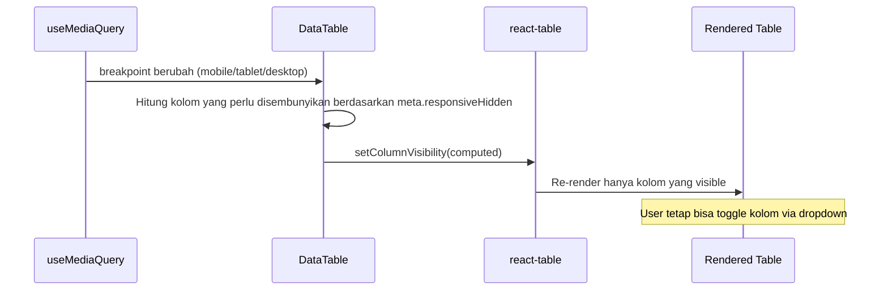

# Dokumen Desain: Responsive Operational Tables

## Overview

Desain ini menjelaskan pendekatan teknis untuk membuat semua tabel operasional responsif di layar mobile dan tablet. Strategi utama adalah memanfaatkan fitur `columnVisibility` bawaan @tanstack/react-table yang dikendalikan oleh ukuran layar, menghapus `whitespace-nowrap` default dari komponen UI primitif, dan menerapkan sticky column pada AcRecapTable.

Pendekatan ini dipilih karena:
- Tidak mengubah API komponen DataTable yang sudah ada secara breaking
- Memanfaatkan fitur bawaan @tanstack/react-table (column visibility state)
- Perubahan bersifat opt-in per kolom melalui column `meta`
- Kompatibel dengan dropdown Column Visibility yang sudah ada

## Architecture

```mermaid
graph TD
    A[useMediaQuery Hook] -->|breakpoint state| B[DataTable Component]
    B -->|columnVisibility state| C[@tanstack/react-table]
    C -->|visible columns| D[Table Render]
    
    E[Column Definition] -->|meta.responsiveHidden| B
    
    F[table.tsx primitives] -->|no default nowrap| D
    
    G[AcRecapTable] -->|sticky column CSS| H[Horizontal Scroll Table]
```

### Alur Responsive Column Visibility



## Components and Interfaces

### 1. Hook: `useMediaQuery`

**Lokasi:** `resources/js/hooks/useMediaQuery.ts`

Hook custom untuk mendeteksi ukuran layar menggunakan `window.matchMedia`. Hook ini mengembalikan boolean yang menunjukkan apakah media query cocok.

```typescript
export function useMediaQuery(query: string): boolean;
```

### 2. Hook: `useResponsiveColumns`

**Lokasi:** `resources/js/hooks/useResponsiveColumns.ts`

Hook yang mengkomputasi `VisibilityState` berdasarkan breakpoint aktif dan konfigurasi `meta.responsiveHidden` pada setiap kolom.

```typescript
import { ColumnDef, VisibilityState } from '@tanstack/react-table';

type ResponsiveHidden = 'mobile' | 'tablet' | 'mobile-tablet';

interface ColumnMetaWithResponsive {
  responsiveHidden?: ResponsiveHidden;
  cellClassName?: string;
}

export function useResponsiveColumns<TData>(
  columns: ColumnDef<TData, any>[]
): VisibilityState;
```

**Logika:**
- `responsiveHidden: 'mobile'` → sembunyikan di < 768px
- `responsiveHidden: 'tablet'` → sembunyikan di < 1024px (mencakup mobile juga)
- `responsiveHidden: 'mobile-tablet'` → sama dengan `'tablet'`, alias semantik

### 3. Perubahan pada `table.tsx`

**Perubahan:**
- Hapus `whitespace-nowrap` dari class default `TableCell`
- Hapus `whitespace-nowrap` dari class default `TableHead`

Kolom yang memerlukan nowrap akan menambahkannya secara eksplisit melalui `meta.cellClassName` atau langsung di cell renderer.

### 4. Perubahan pada `DataTable.tsx`

**Perubahan:**
- Import dan gunakan `useResponsiveColumns`
- Merge state responsive visibility dengan state manual user
- Pastikan toggle visibility dropdown tetap berfungsi (user override)

```typescript
// Di dalam DataTable component
const responsiveVisibility = useResponsiveColumns(columns);

// Merge: responsive sebagai base, user override di atasnya
const mergedVisibility = { ...responsiveVisibility, ...columnVisibility };
```

State `columnVisibility` yang di-manage oleh user (dari dropdown) akan override state responsive. Ini berarti jika user secara manual menampilkan kolom yang disembunyikan secara responsif, kolom tersebut akan tetap tampil.

### 5. Perubahan pada `AcRecapTable.tsx`

**Perubahan:**
- Tambahkan `position: sticky; left: 0; z-index: 10` pada kolom pertama (NO)
- Tambahkan `box-shadow` sebagai visual separator di sisi kanan kolom sticky
- Tambahkan background color pada sticky column agar tidak transparan saat scroll
- Pada mobile (< 768px): kurangi padding dan font-size

### 6. Perubahan pada Filter Containers (Per-Halaman)

**Pola CSS:**
- `SelectTrigger`: Ganti `w-[160px]` / `w-[200px]` menjadi `w-full sm:w-[160px]` / `w-full sm:w-[200px]`
- Container: Sudah menggunakan `flex flex-col gap-4 sm:flex-row` di sebagian besar halaman (pattern yang baik, pertahankan)

### 7. Perubahan pada Pagination (Server-side)

**Perubahan pada pagination sections di setiap halaman:**
- Pada mobile: sembunyikan tombol halaman numerik, tampilkan hanya Prev/Next
- Info jumlah data: sembunyikan pada mobile atau pindah ke baris terpisah
- Pattern: `hidden sm:flex` untuk tombol numerik, `flex sm:hidden` untuk simplified mobile pagination

## Data Models

Tidak ada perubahan model data backend. Semua perubahan bersifat frontend-only.

### Extended Column Meta Type

```typescript
// resources/js/types/table.ts
import { RowData } from '@tanstack/react-table';

declare module '@tanstack/react-table' {
  interface ColumnMeta<TData extends RowData, TValue> {
    /** Breakpoint di mana kolom disembunyikan */
    responsiveHidden?: 'mobile' | 'tablet' | 'mobile-tablet';
    /** Class tambahan untuk cell */
    cellClassName?: string;
  }
}
```

## Error Handling

- **SSR Compatibility:** `useMediaQuery` harus menangani kasus di mana `window` belum tersedia (SSR/Inertia first render). Default ke `false` (anggap desktop) saat server-side.
- **Fallback:** Jika `matchMedia` tidak tersedia, semua kolom tetap ditampilkan (graceful degradation).
- **Hydration Mismatch:** Gunakan `useEffect` untuk set state setelah mount, hindari mismatch antara server render dan client render.

## Testing Strategy

### Pendekatan Testing

Fitur ini bersifat UI rendering dan CSS behavior, sehingga **property-based testing tidak applicable**. Alasan:
- Perubahan utama adalah CSS class dan responsive visibility (visual behavior)
- Tidak ada pure function dengan input/output yang bervariasi secara meaningful
- Behavior diverifikasi melalui visual inspection dan responsive testing
- Logika hook sederhana (boolean match dari matchMedia)

### Unit Tests (Example-Based)

1. **useMediaQuery hook**: Test bahwa hook mengembalikan nilai benar berdasarkan mocked `matchMedia`
2. **useResponsiveColumns hook**: Test bahwa visibility state dihitung dengan benar untuk berbagai kombinasi breakpoint dan column meta
3. **DataTable**: Test bahwa kolom dengan `responsiveHidden: 'mobile'` tidak dirender saat breakpoint mobile aktif

### Manual/Visual Testing

1. Resize browser ke berbagai breakpoint dan verifikasi kolom tersembunyi/tampil
2. Test AcRecapTable sticky column dengan horizontal scroll
3. Verifikasi pagination mobile view
4. Test filter containers pada layar kecil

### Integration Testing

- Test bahwa dropdown Column Visibility masih berfungsi setelah responsive hiding aktif
- Test bahwa user override (menampilkan kolom yang disembunyikan) tetap persist selama session
