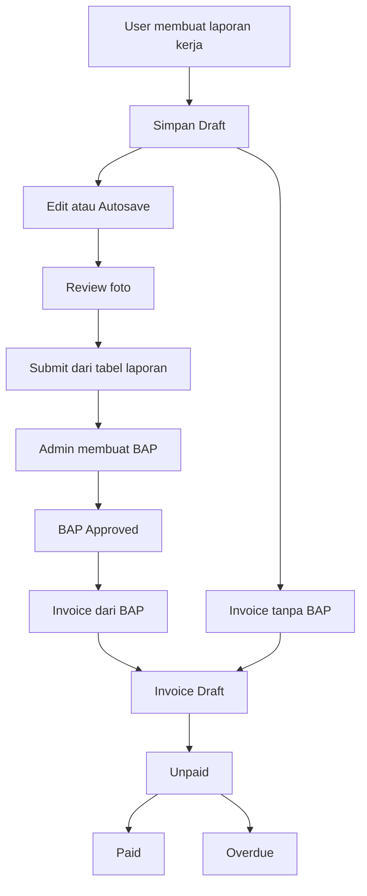

# Management Project

Aplikasi manajemen operasional untuk mengelola laporan kerja teknisi, dokumentasi foto, BAP, invoice, dan pembayaran dalam satu alur kerja.

## Daftar Isi

- [Tentang Aplikasi](#tentang-aplikasi)
- [Fitur Utama](#fitur-utama)
- [Alur Bisnis](#alur-bisnis)
- [Teknologi](#teknologi)
- [Persyaratan Sistem](#persyaratan-sistem)
- [Instalasi Lokal](#instalasi-lokal)
- [Menjalankan Aplikasi](#menjalankan-aplikasi)
- [DDEV](#ddev)
- [Testing dan Validasi](#testing-dan-validasi)
- [Struktur Direktori](#struktur-direktori)
- [Dokumentasi](#dokumentasi)
- [Catatan Pengembangan](#catatan-pengembangan)

## Tentang Aplikasi

Management Project membantu perusahaan jasa IT/teknis mengelola proses operasional dari laporan pekerjaan sampai penagihan.

Aplikasi menyediakan:

- Laporan kerja dengan status draft dan submitted.
- Dokumentasi foto sebelum dan sesudah pekerjaan.
- Kolaborasi beberapa user pada laporan yang sama.
- Pembuatan BAP dari laporan kerja yang sudah submitted.
- Pembuatan invoice dari BAP approved atau tanpa BAP.
- Export dokumen BAP dan invoice ke PDF.
- Dashboard untuk memantau pekerjaan, invoice, dan pendapatan.

## Fitur Utama

### Manajemen User dan Hak Akses

Role yang digunakan aplikasi:

- **Admin** — mengelola master data, user, BAP, invoice, dan proses administrasi.
- **Staff** — mengelola laporan dan proses operasional sesuai hak akses.
- **Teknisi** — membuat dan memperbarui laporan kerja.

Semua user tidak dapat menghapus akun sendiri. Admin juga tidak dapat menghapus akun yang sedang digunakan.

### Master Data

- Klien: nama, alamat, NPWP, PIC, nomor telepon, dan status aktif.
- Kategori pekerjaan.
- Jasa dan produk: kode, nama, satuan, harga satuan, dan tipe item.
- Pengaturan perusahaan dan informasi rekening untuk PDF invoice.

### Laporan Kerja

- Membuat laporan pekerjaan sebagai draft.
- Memilih klien dan kategori pekerjaan.
- Mengisi detail aktivitas serta data pengukuran pekerjaan.
- Menambahkan foto **before** dan **after**.
- Create, update, dan autosave tidak melakukan submit otomatis.
- Submit hanya dilakukan dari tabel laporan dan memerlukan konfirmasi.
- Laporan dapat diedit oleh user lain tanpa mengganti pemilik awal.

#### User Collaborator

Setiap user yang membuat, mengedit, atau melakukan autosave pada laporan dicatat sebagai collaborator.

Collaborator ditampilkan sebagai:

- Badge lingkaran yang saling menumpuk.
- Detail nama saat hover, fokus, atau klik.
- Panel detail untuk melihat seluruh user collaborator.

### Dokumentasi Foto

Foto dapat ditambahkan melalui dua mode:

- Upload file.
- Kamera perangkat.

Keduanya menggunakan review queue sebelum dikirim ke server:

1. User memilih atau mengambil foto.
2. Foto tampil pada section **Review Foto**.
3. User dapat mengubah keterangan foto.
4. User dapat menghapus foto yang belum dikirim.
5. User menekan **Unggah Semua**.

Pemrosesan foto:

- Foto dikonversi ke WebP sebelum request upload.
- Foto dikompres dengan batas maksimal 10 MB per file.
- Ukuran kamera diturunkan agar lebih ringan.
- Server menerima JPG, JPEG, PNG, dan WebP dengan validasi maksimal 10 MB.

### BAP

- BAP dibuat dari satu atau beberapa laporan kerja submitted.
- Nomor surat dibuat otomatis.
- BAP memiliki status draft dan approved.
- BAP dapat diekspor ke PDF.
- BAP approved dapat digunakan sebagai sumber invoice.

### Invoice

Invoice dapat dibuat dengan dua cara:

1. Memilih BAP approved yang belum memiliki invoice.
2. Memilih `Tanpa BAP` dan mengisi data secara manual.

Jika BAP dipilih:

- Klien otomatis mengikuti klien pada BAP.
- Tanggal mulai pekerjaan diambil dari laporan kerja paling awal.
- Tanggal selesai pekerjaan diambil dari laporan kerja paling akhir.
- Klien dan periode pekerjaan dikunci agar konsisten dengan BAP.

Jika tanpa BAP:

- Klien dapat dipilih manual.
- Tanggal pekerjaan dapat diisi manual dan bersifat opsional.

Invoice mendukung:

- Item jasa atau produk.
- Input item manual.
- Harga satuan.
- Kuantitas.
- Diskon per item atau total.
- PPN.
- Biaya pengiriman.
- Status draft, unpaid, overdue, dan paid.
- Export PDF.

PDF invoice menggunakan label **Harga Satuan**. Bagian tanda tangan **Diterima Oleh** tidak menampilkan nama penerima dan hanya menyediakan garis tanda tangan.

## Alur Bisnis



## Teknologi

### Backend

- PHP 8.3+
- Laravel 13
- Eloquent ORM
- Laravel Inertia
- Laravel Sanctum
- Spatie Laravel Permission
- Laravel Filesystem
- `barryvdh/laravel-dompdf`
- FPDI/FPDF untuk kebutuhan PDF tertentu

### Frontend

- React 18
- TypeScript
- Inertia React
- Vite
- Tailwind CSS 4
- Base UI
- React Hook Form
- Zod
- Recharts
- Lucide React
- Sonner

### Database dan Development Environment

- MariaDB/MySQL untuk penggunaan utama.
- SQLite dapat digunakan untuk development dan testing.
- DDEV tersedia sebagai konfigurasi environment lokal.

## Persyaratan Sistem

Pastikan tersedia:

- PHP 8.3 atau lebih baru.
- Composer 2.
- Node.js dan npm.
- Database SQLite, MySQL, atau MariaDB.
- Ekstensi PHP yang dibutuhkan Laravel.
- DDEV dan Docker jika menggunakan environment DDEV.

## Instalasi Lokal

Clone repository dan masuk ke direktori proyek:

```bash
git clone <repository-url>
cd Manajement-project
```

Install dependency PHP dan frontend:

```bash
composer install
npm install
```

Buat file environment:

```bash
cp .env.example .env
php artisan key:generate
```

Konfigurasikan koneksi database pada `.env`, kemudian jalankan migration:

```bash
php artisan migrate
```

Jika membutuhkan data awal, jalankan seeder yang tersedia:

```bash
php artisan db:seed
```

Buat symbolic link storage untuk file publik:

```bash
php artisan storage:link
```

Build frontend:

```bash
npm run build
```

### Setup Otomatis

Composer menyediakan script setup yang menjalankan langkah utama secara berurutan:

```bash
composer run setup
```

Script tersebut menjalankan instalasi Composer, membuat `.env` jika belum ada, generate application key, migration, instalasi npm, dan build frontend.

## Menjalankan Aplikasi

Untuk development frontend:

```bash
npm run dev
```

Untuk menjalankan server Laravel secara terpisah:

```bash
php artisan serve
```

Untuk menjalankan server, queue listener, log viewer, dan Vite secara bersamaan:

```bash
composer run dev
```

Akses aplikasi melalui URL yang ditampilkan oleh server Laravel atau konfigurasi environment yang digunakan.

## DDEV

Proyek menyediakan `.ddev/config.yaml` dengan konfigurasi:

- Tipe aplikasi: Laravel.
- Web root: `public`.
- PHP: 8.3.
- Web server: nginx-fpm.
- Database: MariaDB 10.11.

Perintah dasar:

```bash
ddev start
ddev composer install
ddev npm install
ddev artisan key:generate
ddev artisan migrate
ddev artisan storage:link
ddev npm run build
```

Untuk membuka aplikasi:

```bash
ddev launch
```

## Testing dan Validasi

Jalankan seluruh test suite:

```bash
php artisan test
```

Atau gunakan script Composer:

```bash
composer run test
```

Menjalankan test fitur tertentu:

```bash
php artisan test tests/Feature/InvoiceControllerTest.php
php artisan test tests/Feature/WorkReportControllerTest.php
php artisan test tests/Feature/WorkReportAutosaveTest.php
php artisan test tests/Feature/ProfileTest.php
```

Validasi build frontend:

```bash
npm run build
```

Validasi sintaks PHP pada file tertentu:

```bash
php -l app/Http/Controllers/InvoiceController.php
php -l resources/views/pdf/invoice.blade.php
```

## Struktur Direktori

```text
app/
├── Http/Controllers/       Controller aplikasi
├── Http/Requests/          Validasi request
├── Models/                 Model Eloquent
└── Services/               Logika domain dan service aplikasi

database/
├── factories/              Factory untuk test
├── migrations/             Struktur database
└── seeders/                Data awal

resources/
├── js/Components/          Komponen React reusable
├── js/Pages/               Halaman Inertia/React
└── views/pdf/              Template PDF Blade

routes/
└── web.php                 Route aplikasi

tests/
├── Feature/                Test alur aplikasi
└── Unit/                   Test unit service

prd.md                     Product Requirements Document
```

## Dokumentasi

- [`prd.md`](prd.md) — requirement produk, alur bisnis, dan model data.
- [`resources/views/pdf/`](resources/views/pdf/) — template dokumen PDF.
- [`tests/`](tests/) — test fitur dan unit.
- [Dokumentasi Laravel](https://laravel.com/docs)
- [Dokumentasi Inertia](https://inertiajs.com/)

## Catatan Pengembangan

- Jangan mengubah laporan kerja menjadi laporan baru ketika user mengedit laporan yang sudah ada. ID laporan harus diteruskan pada autosave dan update.
- `technician_id` tetap merepresentasikan pemilik awal laporan; collaborator disimpan pada pivot terpisah.
- Jangan mengaktifkan kembali submit otomatis pada halaman create atau edit laporan kerja.
- Upload foto harus melalui review queue sebelum dikirim.
- BAP pada invoice bersifat opsional, tetapi jika dipilih harus approved dan belum terhubung dengan invoice lain.
- Jangan menambahkan kembali fitur penghapusan akun oleh user sendiri.
- Jangan menyimpan credential atau secret ke repository.

## Lisensi

Proyek ini menggunakan lisensi internal sesuai kebijakan perusahaan.
